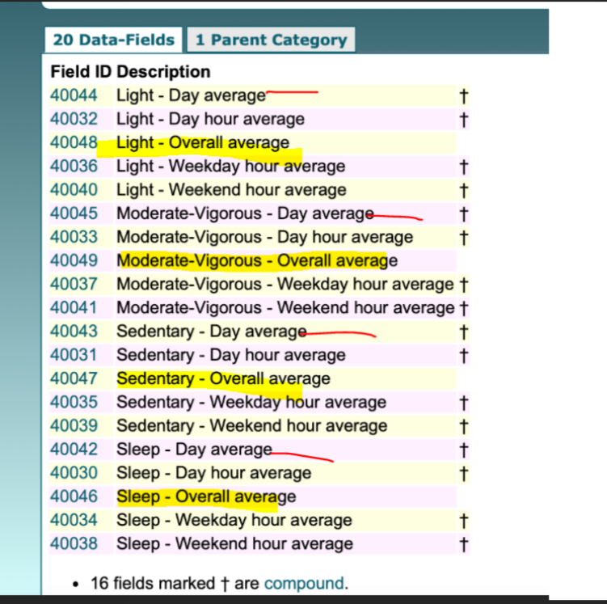

This directory is supposed to contain randomly selected cwa files from the 100,000 raw dataset.

Count all rows in the proportion data file:
cat /lustre03/project/6008063/neurohub/UKB/Tabular/RAP/ukb_category_1020.csv | wc -l

But we have many rows without any data: (sample)
eid,40044-0.0,40032-0.0,40048-0.0,40036-0.0,40040-0.0,40045-0.0,40033-0.0,40049-0.0,40037-0.0,40041-0.0,40043-0.0,40031-0.0,40047-0.0,40035-0.0,40039-0.0,40042-0.0,40030-0.0,40046-0.0,40034-0.0,40038-0.0
XXXXXXX,,,,,,,,,,,,,,,,,,,,
XXXXXXX,,,,,,,,,,,,,,,,,,,,
XXXXXXX,"0.44,0.37,0.31,0.23,0.35,0.26,0.24","0,0,0,0,0,0,0.56,0.49,0.69,0.47,0.41,0.37,0.5,0.42,0.46,0.48,0.27,0.54,0.45,0.5,0.38,0.24,0.25,0.09",0.31418,"0,0,0,0,0,0,0.78,0.64,0.81,0.59,0.45,0.34,0.46,0.42,0.34,0.39,0.31,0.65,0.48,0.4,0.38,0.29,0.3,0.1","0,0,0,0,0,0,0,0.1,0.37,0.16,0.29,0.44,0.58,0.41,0.76,0.7,0.15,0.25,0.37,0.74,0.4,0.12,0.11,0.07","0.06,0.03,0.03,0.05,0.05,0.11,0.06","0,0,0,0,0,0,0,0.04,0.07,0.17,0.1,0.14,0,0.17,0.07,0.06,0.05,0,0,0.24,0.19,0,0.04,0",0.0559,"0,0,0,0,0,0,0,0.06,0,0.06,0,0,0,0.24,0.1,0.05,0.03,0,0,0.28,0.2,0,0.05,0","0,0,0,0,0,0,0,0,0.25,0.45,0.35,0.5,0,0,0,0.09,0.09,0,0,0.11,0.16,0,0,0","0.16,0.33,0.3,0.39,0.24,0.22,0.25","0,0,0,0,0,0,0,0.22,0.15,0.36,0.49,0.49,0.5,0.4,0.47,0.46,0.68,0.46,0.52,0.27,0.36,0.38,0.22,0.03",0.26905,"0,0,0,0,0,0,0,0.31,0.19,0.35,0.55,0.66,0.54,0.34,0.56,0.56,0.66,0.35,0.48,0.32,0.4,0.41,0.08,0.04","0,0,0,0,0,0,0,0,0.04,0.39,0.35,0.06,0.42,0.54,0.24,0.21,0.75,0.75,0.63,0.15,0.29,0.29,0.55,0","0.34,0.27,0.36,0.33,0.36,0.4,0.45","1,1,1,1,1,1,0.44,0.26,0.1,0,0,0,0,0.01,0,0,0,0,0.03,0,0.06,0.38,0.5,0.88",0.36087,"1,1,1,1,1,1,0.22,0,0,0,0,0,0,0,0,0,0,0,0.04,0,0.03,0.3,0.57,0.86","1,1,1,1,1,1,1,0.9,0.34,0,0,0,0,0.05,0,0,0,0,0,0,0.15,0.59,0.34,0.93"

### How to randomly select files?
From the source location, /lustre03/project/6008063/neurohub/UKB/Tabular/RAP/ukb_category_1020.csv
We read only those fields without all ',' and randomly select 22 samples as follows:
cat /lustre03/project/6008063/neurohub/UKB/Tabular/RAP/ukb_category_1020.csv | grep -v ",,,,,,,,,,,,,,,,,,,," | shuf -n 22

You can pipe the output to a separate file and add header for easy reference.
This is what each field means: 

Export the eids columns to get the list of cwa files we need for further processing.

### How to obtain the cwa files?
Use the [search_files](../search_files.sh) script to get full file paths.
An example: [file_paths](file_paths.txt)
Use the [copy_files](copy_files.sh) script to get the cwa files for the file_paths list.
